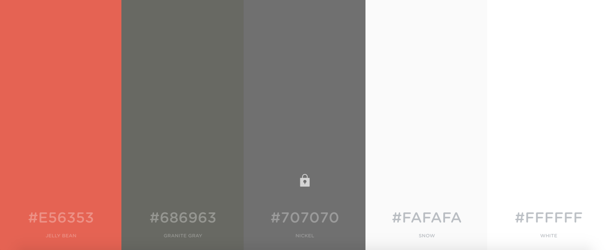

Premaquetación tiatomate

El index tendrá la siguiente distribución

en el celular tendra el siguiente formato

la estructura de directorio es 
# tiatomate

Contenido
En la pagina utilizaremos
contaniner
jumbotron
navbar
grid
images
card
carousel
botom
iconos

tipografia
las fuentes a utilizar son
OpenSans-Regular.ttf
Raleway-Bold.ttf
Raleway-ExtraLight.ttf

colores
La paleta de colores a usar es 

